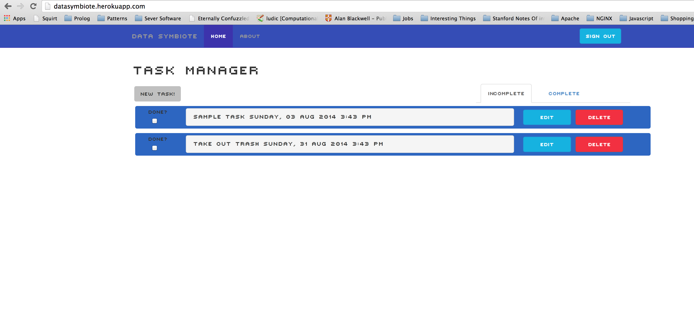

Data Symbiote Task Manager
=========================

- A task manager application that exports user data as an exposed API, for use with other projects. Developed by [Alex Wong] and [Joseph Wolf].

- The aim is to present and export data in a way that is both intuitive for users to create, and flexible for developers to use in statistical analysis or data visualization.

- Use the task manager app here [on Heroku].

- See a working demonstration of the API: [DataBounce] developed by [Robert Leon]

## Usage

- Data Symbiote was designed to be easy and intuitive for the end user. 

- With extra parameters associated with a task, this data can be used to change the way we display tasks.

- After signing up, users can add new tasks with fields such as deadline, importance, difficulty, category and description.

- This data can then be accessed by applications at /api/tasks (with the correct user token).

## Technology

- This project was made using the Ruby on Rails framework and postgres database.

- The user interface uses Javascript, AJAX and JSON elements and was styled with Twitter Bootstrap.

- The user system and database was made using Devise and bcrypt security protocols.

[Alex Wong]:https://github.com/mazzastar
[Joseph Wolf]:https://github.com/josephwolf
[on Heroku]:http://datasymbiote.herokuapp.com/
[DataBounce]:https://github.com/llexileon/datavisual
[Robert Leon]:https://github.com/llexileon
